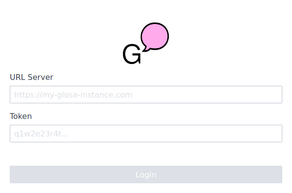
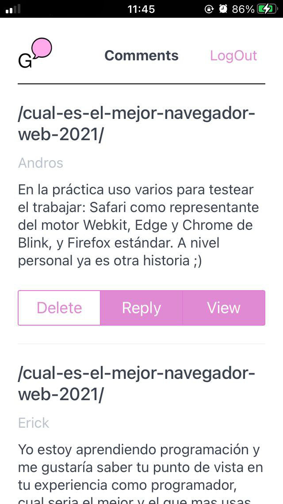
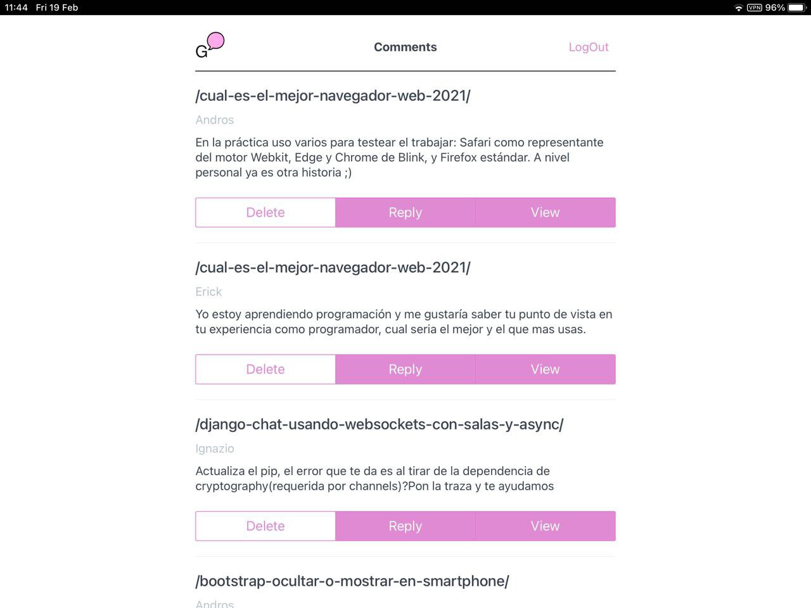

<p align="center">
   
</p>
<h1 align="center">Glosa Admin: PWA</h1>
<p align="center">
  <a href="https://glosa.github.io/glosa-admin/">👉 USE NOW 👈</a>
</p>
<p align="center">
   <strong >Manage your Glosa site comfortably from wherever you want.</strong>
</p>

<p align="center">
   
</p>

<p align="center">
   
</p>

<p align="center">
   
</p>


### Install

```
npm i
npm i -g sass @vue/cli
```

## Production

Compile SASS

```
node-sass src/sass/main.sass:public/css/main.css
```

After compiles and minifies for production

```
npm run build
```

## Development

### Compiles and hot-reloads for development

```
npm run serve
```


### Lints and fixes files

```
npm run lint
```

### SASS Watch: Autocompile if it detects changes

```
node-sass --watch src/sass/main.sass:public/css/main.css
```
